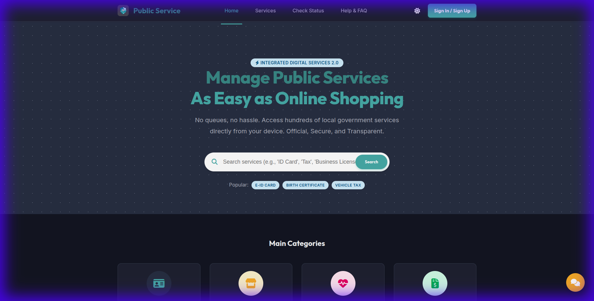
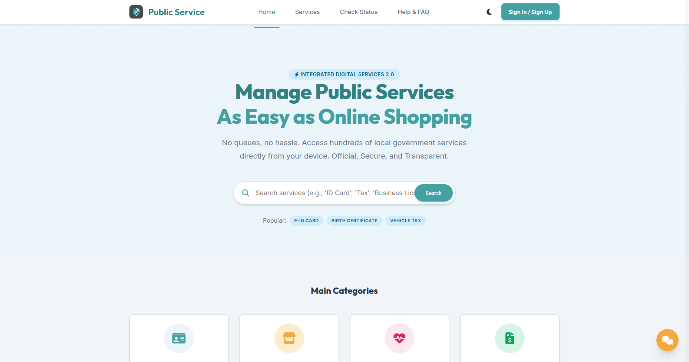

<div align="center">

<h1>Public Service Portal Template</h1>

  

<br>

<h3>Modern, Responsive Web Template for Government Public Services</h3>
<p><i>A comprehensive portal solution built with Vanilla HTML/CSS/JS for citizen-facing services.</i></p>
</div>

<div align="center">

[](https://public-services-template.vercel.app)

</div>

<div align="center" style="display: flex; gap: 10px;">
    
    
</div>

## 📋 About This Template

The **Public Service Portal** is a comprehensive, ready-to-use website template designed specifically for government agencies and public service organizations. Built with modern web technologies and best practices, this template provides an intuitive interface for citizens to access public services online.

### 🎯 Perfect For:
- 🏢 Government agencies
- 🏛️ Municipal offices
- 📄 Public service departments
- 🌐 Citizen service portals
- 📊 Administrative departments

---

## ✨ Key Features

### 🎨 Modern Design
- **Clean & Professional** - Sleek interface that builds trust
- **Fully Responsive** - Perfect on desktop, tablet, and mobile
- **Dark Mode Support** - Automatic theme switching with user preference saving
- **Consistent Branding** - Unified design system across all pages

### 🚀 Performance & UX
- **Lightning Fast** - Vanilla JS/CSS with no heavy frameworks
- **Smooth Animations** - Polished micro-interactions
- **Mobile-First** - Optimized for smartphones (≤768px)
- **Accessibility** - Semantic HTML and ARIA labels

### 🛠️ Technical Highlights
- **Pure HTML/CSS/JS** - No dependencies, easy to customize
- **Component-Based** - Reusable buttons, cards, and badges
- **localStorage Integration** - Theme and auth state persistence
- **SEO Optimized** - Proper meta tags and semantic structure

---

## 📄 Page Structure & Functions

### 🏠 **Home Page** (`pages/home/index.html`)
**Purpose:** Landing page introducing the portal and its benefits

**Features:**
- Hero section with call-to-action
- Service categories overview
- Real-time statistics dashboard
- Featured services carousel
- Benefits and value propositions

---

### 🗂️ **Service Catalog** (`pages/services/index.html`)
**Purpose:** Browse and search all available public services

**Features:**
- Advanced filtering sidebar (category, availability, tags)
- Search functionality
- Service cards with quick info (processing time, office)
- Pagination for large service lists
- "Online" badge indicators

**Key Info Displayed:**
- Service name and description
- Processing time estimate
- Responsible office/department
- Online availability status

---

### 📋 **Service Detail** (`pages/services/detail.html`)
**Purpose:** Detailed information about a specific service

**Features:**
- Complete service description
- Requirements and prerequisites
- Step-by-step process guide
- Required documents list
- Fee structure
- Office contact information
- Direct "Apply Now" action

---

### 📝 **Service Application** (`pages/services/apply.html`)
**Purpose:** Submit applications for public services

**Features:**
- Multi-step form wizard
- Auto-fill from user profile
- Document upload interface
- Form validation
- Application preview before submission
- Success confirmation page

**Form Sections:**
- Personal information
- Service-specific requirements
- Supporting documents
- Declaration and terms

---

### 📊 **Application Status** (`pages/user/status.html`)
**Purpose:** Track submitted application progress

**Features:**
- Interactive timeline showing progress stages:
  - Submitted
  - Verified
  - Processing
  - Done
- Real-time status updates
- Application ID reference
- Estimated completion date
- Contact officer button
- Document download (when completed)

---

### 👤 **User Profile** (`pages/user/profile.html`)
**Purpose:** Manage user account and personal information

**Features:**
- Personal information display
- Contact details management
- Profile picture upload
- Account settings
- Password change
- Notification preferences

**Profile Sections:**
- Basic information (Name, NIK, Email, Phone)
- Address details
- Account security
- Linked services

---

### ❓ **FAQ & Support** (`pages/support/faq.html`)
**Purpose:** Provide self-service help and common answers

**Features:**
- Expandable/collapsible FAQ items
- Category-based organization
- Search functionality
- Contact support form
- Live chat widget
- Help center resources

**FAQ Categories:**
- Account & Registration
- Service Applications
- Document Requirements
- Processing Times
- Fees & Payments

---

### 🔐 **Authentication Pages**

#### **Login** (`pages/auth/login.html`)
**Purpose:** User authentication and access control

**Features:**
- Email/NIK login
- Password field with show/hide toggle
- "Remember me" option
- Forgot password link
- Google sign-in integration
- Auto-redirect after login

#### **Register** (`pages/auth/register.html`)
**Purpose:** New user account creation

**Features:**
- Step-by-step registration form
- Email verification
- Password strength indicator
- Terms & conditions checkbox
- Google sign-up option
- Duplicate account detection

**Required Fields:**
- Full name
- NIK (National ID)
- Email address
- Phone number
- Password + confirmation

---

## 🚀 Getting Started

### Prerequisites
- Modern web browser (Chrome, Firefox, Safari, Edge)
- Text editor (VS Code, Sublime, etc.)
- Basic knowledge of HTML/CSS/JS

### Installation

1. **Clone the repository**
   ```bash
   git clone https://github.com/fritzkmanurung/Public-Services-Template.git
   cd Public-Services-Template
   ```

2. **Open in browser**
   ```bash
   # Simply open index.html in your browser
   # Or use Live Server extension in VS Code
   ```

3. **Start customizing!**
   - Update `assets/logo.png` with your organization's logo
   - Modify colors in `css/style.css` (CSS variables)
   - Edit content in HTML files
   - Customize service data in JS files

---

## 📁 Project Structure

```
portal-layanan-publik/
├── assets/
│   ├── logo.png           # Organization logo
│   ├── lightmode.png      # Light mode screenshot
│   └── darkmode.png       # Dark mode screenshot
├── css/
│   └── style.css          # Main stylesheet (design system)
├── js/
│   ├── main.js            # Core JavaScript logic
│   └── theme.js           # Theme toggle functionality
├── pages/
│   ├── auth/
│   │   ├── login.html     # Login page
│   │   └── register.html  # Registration page
│   ├── home/
│   │   └── index.html     # Landing page
│   ├── services/
│   │   ├── index.html     # Service catalog
│   │   ├── detail.html    # Service details
│   │   └── apply.html     # Application form
│   ├── user/
│   │   ├── status.html    # Application tracker
│   │   └── profile.html   # User profile
│   └── support/
│       └── faq.html       # FAQ & help
├── layouts/
│   ├── header.html        # Reusable header component
│   └── footer.html        # Reusable footer component
├── index.html             # Entry point (redirects to home)
└── README.md              # This file
```

---

## 🎨 Customization Guide

### Colors & Branding

Edit CSS variables in `css/style.css`:

```css
:root {
    --color-primary: hsl(180, 40%, 45%);      /* Teal */
    --color-secondary: hsl(180, 40%, 95%);    /* Light teal */
    --color-accent: hsl(35, 90%, 60%);        /* Orange */
    --font-heading: 'Outfit', sans-serif;
    --font-body: 'Inter', sans-serif;
}
```

### Logo Replacement

Replace `assets/logo.png` with your organization's logo:
- Recommended size: 150x150px (SVG or PNG)
- Transparent background preferred
- Update all header references if needed

### Service Data

Modify service cards in `pages/services/index.html`:
- Update service names, descriptions
- Change processing times
- Edit office/department names
- Add/remove services as needed

---

## 🛠️ Technologies Used

| Technology | Purpose |
|-----------|---------|
| **HTML5** | Structure and semantic markup |
| **CSS3** | Styling and responsive design |
| **Vanilla JavaScript** | Interactivity and logic |
| **Font Awesome** | Icon library (CDN) |
| **Google Fonts** | Typography (Outfit, Inter) |
| **LocalStorage API** | Theme and auth persistence |

---

## 📱 Responsive Breakpoints

- **Desktop:** ≥1024px (full sidebar navigation)
- **Tablet:** 769px - 1023px (adaptive layout)
- **Mobile:** ≤768px (hamburger menu, stacked layout)

All font sizes, paddings, and elements auto-adjust for optimal viewing.

---

## ♿ Accessibility

- ✅ Semantic HTML5 elements
- ✅ ARIA labels for interactive components
- ✅ Keyboard navigation support
- ✅ Color contrast compliance (WCAG AA)
- ✅ Responsive text sizing
- ✅ Focus indicators

---

## 🌐 Browser Support

| Browser | Minimum Version |
|---------|----------------|
| Chrome | 90+ |
| Firefox | 88+ |
| Safari | 14+ |
| Edge | 90+ |
| Opera | 76+ |

---

## 📝 License

This project is licensed under the **MIT License** - see the [LICENSE](LICENSE) file for details.

---

## 👨‍💻 Author

**Fritz Kevin Manurung**

- GitHub: [@fritzkmanurung](https://github.com/fritzkmanurung)
- Template: [Public Services Template](https://github.com/fritzkmanurung/Public-Services-Template)

---

## 🤝 Contributing

Contributions, issues, and feature requests are welcome!

1. Fork the project
2. Create your feature branch (`git checkout -b feature/AmazingFeature`)
3. Commit your changes (`git commit -m 'Add some AmazingFeature'`)
4. Push to the branch (`git push origin feature/AmazingFeature`)
5. Open a Pull Request

---

## ⭐ Show Your Support

Give a ⭐ if this project helped you!

---

## 📞 Support & Contact

Need help or have questions?

- 📧 Email: support@example.com
- 🐛 Issues: [GitHub Issues](https://github.com/fritzkmanurung/Public-Services-Template/issues)
- 💬 Discussions: [GitHub Discussions](https://github.com/fritzkmanurung/Public-Services-Template/discussions)

---

<div align="center">

**Built with ❤️ for better public services**

[](https://public-services-template.vercel.app)

</div>
